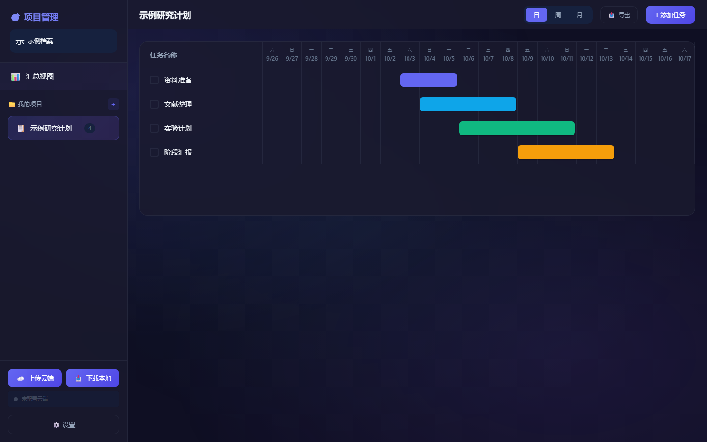

# Gantt OSS · 甘特图项目管理

[English](README.en.md) · [MIT](LICENSE) · [贡献指南](CONTRIBUTING.md) · [安全说明](SECURITY.md)

面向课程、研究与个人项目的轻量甘特图工具。数据默认保存在浏览器本地；可选接入 JSONBin 云端同步和 Cloudflare Workers 邮件提醒。界面使用中文，前端由原生 HTML、CSS、JavaScript 构成，无运行时依赖、无需构建即可启动。



## 功能

- 创建、编辑、删除项目和任务，设置日期、备注、颜色与完成状态。
- 日、周、月视图，以及跨项目汇总视图；支持时间轴滚动与缩放。
- 周期任务：完成后创建下一周期任务。
- PNG 图片导出，支持不同尺寸、详细程度与六种主题。
- 多个本地档案，分别保存项目与同步配置。
- 可选 JSONBin 同步；可选到期、过期邮件提醒。

本地档案名用于切换浏览器中的数据，**没有密码验证或访问控制**。这适合可信设备上的个人使用；部署为团队服务需要另行实现服务端身份验证和权限控制。

## 快速开始

安装 Node.js 22 或 24，然后：

```sh
git clone https://github.com/Brighthao18/gantt-oss.git
cd gantt-oss
node scripts/serve.mjs
```

打开 <http://127.0.0.1:4173>，输入本地档案名，即可创建项目和任务。纯本地使用不需要账号、API Key 或安装 npm 依赖。

数据按网站地址和浏览器分别保存。清除浏览器数据、切换浏览器或端口，可能使原数据不可见；图片导出不含可恢复的原始数据。请保留浏览器数据，或使用自行配置的云端同步备份。

## 开发与检查

```sh
npm ci
npm run verify
npx playwright install chromium
npm run test:e2e
npm run worker:check
```

`verify` 执行语法、编码、敏感信息模式检查、单元测试与静态构建。浏览器测试使用独立本地环境和虚构数据，云端请求由测试替身处理，不发送真实邮件。

```sh
npm start          # 本地开发
npm run build      # 仅将公开浏览器资源输出到 dist/
```

Cloudflare Pages 或其他静态托管服务应使用 `npm run build`，发布目录设置为 `dist`。不要将项目根目录作为发布目录，其中可能包含本地配置。

## 可选云端同步与邮件

在界面的设置中填写自己的 JSONBin API Key 和 Bin ID；首次使用可留空 Bin ID。密钥只保存在当前浏览器的对应档案中。密钥字段留空并保存可关闭同步。自动同步在修改后等待约五秒；关闭页面前应确认显示“已同步”。

邮件提醒还需要自行配置 JSONBin、Resend 和 Cloudflare Workers。详见 [部署指南](docs/deployment.md)。不要在浏览器中填写 Resend 密钥，也不要将密钥放入仓库、截图、问题单或普通 Wrangler `vars`。

## 项目结构

| 路径 | 用途 |
| --- | --- |
| `index.html` / `styles.css` | 中文界面与样式 |
| `app.js` | 本地档案、项目、任务、时间轴与交互 |
| `api.js` | 可选 JSONBin 同步 |
| `export-enhanced.js` | 当前 PNG 导出实现 |
| `worker.js` | 独立的邮件提醒服务 |
| `wrangler.example.jsonc` / `.dev.vars.example` | 无密钥的配置模板 |
| `scripts/` / `tests/` | 本地工具与自动检查 |
| `docs/` | 架构、部署、隐私与开源项目支持说明 |

## 参与项目

欢迎提交问题和改进建议。提交代码前请阅读 [CONTRIBUTING.md](CONTRIBUTING.md) 与 [行为准则](CODE_OF_CONDUCT.md)。漏洞请通过 [私密安全报告](https://github.com/Brighthao18/gantt-oss/security/advisories/new) 提交，不要在公开问题中暴露密钥或用户数据。

项目已加入 GitHub Actions 自动检查。AI 辅助贡献需由提交者复核并说明使用情况；项目文档不将自动化检查等同于完整安全审计。

有关 OpenAI Codex for OSS 的申请入口和事实材料，见 [项目支持说明](docs/codex-for-oss.md)。开源或使用 Codex 不代表已获该计划支持。

## 许可证

项目代码以 [MIT](LICENSE) 许可证发布。可选第三方服务适用各自条款；开发依赖保留其各自许可证。
