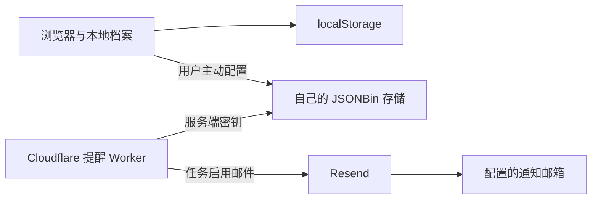

# 架构与数据流

浏览器页面依次加载 `api.js`、`export-enhanced.js`、`app.js`。前端不依赖框架或服务器。`scripts/serve.mjs` 只为开发提供公开资源；静态托管发布 `dist/` 即可。

`UserManager` 选择档案；`DataStore` 读写 `gantt_data_<档案名>`；`AppState` 处理当前视图和同步；`UI` 负责表单、时间轴、汇总和图片导出。`CloudAPI` 负责 JSONBin 读写，`worker.js` 在独立服务端运行。

数据顶层包含 `projects`、`lastModified`、`version`，项目包含 `id`、`name`、`tasks`，任务包含 `id`、`name`、`startDate`、`endDate`、`notes`、`color`、`completed`、`reminder` 与 `recurrence`。读取旧任务时仍兼容 `progress === 100`。

任务日期主要为 HTML `datetime-local` 的本地墙钟字符串。提醒 Worker 按 `REMINDER_TIMEZONE` 比较日历日期；带 UTC 标志或时区偏移的 ISO 时间先转换到该时区。默认 `Asia/Shanghai`，Cron 表达式始终使用 UTC。

各档案独立保存 JSONBin Key、Bin ID、通知邮箱和主控 Bin ID。旧版全局 Key、通知邮箱、主控 Bin ID 首次升级时迁移给当前档案；如果没有当前档案，迁移至下一次选中的档案。其他档案需要单独配置。项目数据存储键不变。

同步上传为整条记录覆盖，下载替换当前本地数据；并不支持并发编辑合并。等待中的上传会在切换档案或关闭同步时取消。已经发出的网络请求无法撤回，返回后需核对档案是否仍然相同。
